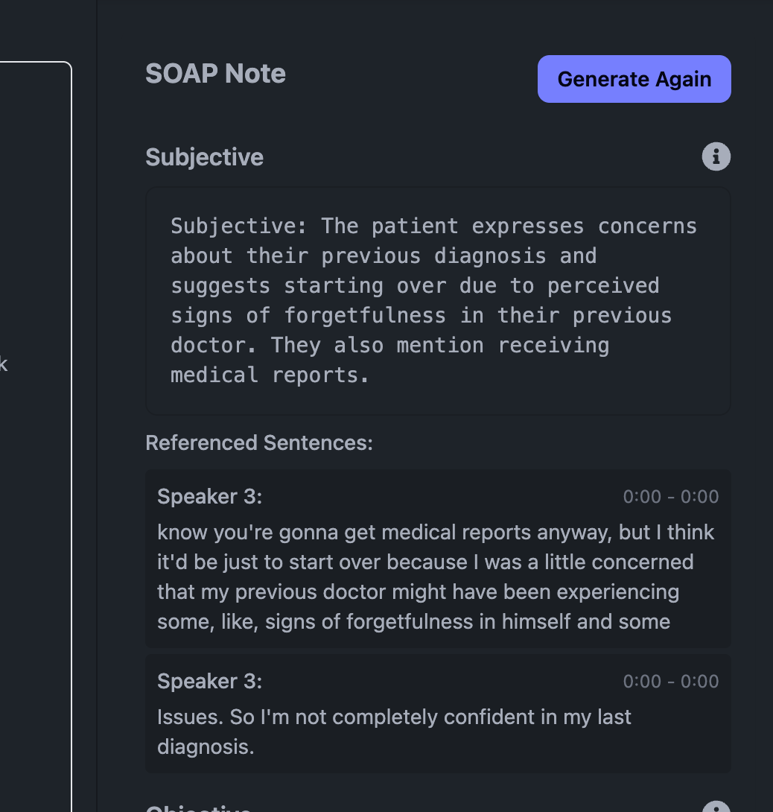
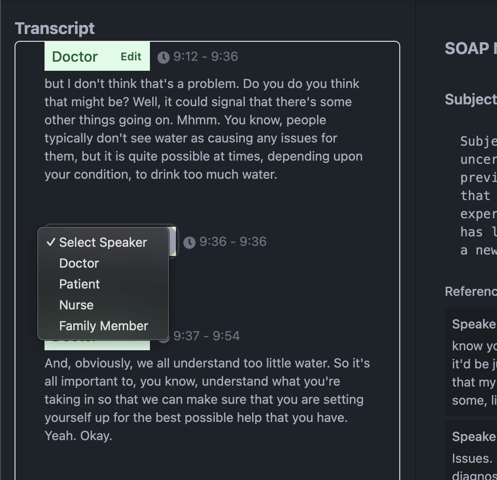

# Setup
- `./run.sh`

### Requirements
- Python 3.11
- pipenv
- Node.js

# Technologies used
- Django with Django-Ninja
- TypeScript React
- Deepgram for transcription
- Ollama
  - all-minilm (embeddings)
  - llama3 (LLM)

# Optimizations
- Record in a compressed format (audio/webm with Opus codec) to keep file size manageable
  - Took 39 sec for Deepgram to transcribe a 40 minute audio
- Async operations
  - Render transcript in the UI while text extraction is going on - Improves UI
  - Polling for status updates - Improves UI
- Use `nova-2-medical` for transcription for better performance with medical data
- 

# Edgecases covered
1. How would you create a mapping between each line in the final SOAP note and the excerpts from the transcript from which it was inferred? (So that a physician could hover over that line and see where it came from, as they review the note for accuracy before they sign it)
- How I've handled this edge-case in my app
  - I'm assigning unique sentence_ids to each sentence, and passing them as metadata while performing RAG. I am displaying these sentences as references in the UI
  

2. Design a feedback loop that improves accuracy over time based on clinician edits
- 

3. How would you handle medical conversations with multiple speakers (provider, patient, nurse, family member)?

- How I've handled this edge-case in my app
   - Deepgram has a parameter `diarize` that can be passed as `true` to automatically get speaker details with each word
   - From my testing it might show more speakers sometimes and also incorrectly label speakers some times. So I have included speaker mapping functionality in the UI. It lets clinicians label speakers with the sentences extracted from the transcript
   - I'm storing these mappings with the transcription in the DB
   - With enough data, we can train a model and fine tune it to automatically map speakers for future transcriptions
  

4. How would your system manage poor audio quality or strong accents?
- How I've handled this edge-case in my app
   - I'm using an external API Deepgram, which is good at handling audio quality and accents.
   - Also, using the `nova-2-medical` model for transcription prevents mis-interpreting medical jargons said in different accents
